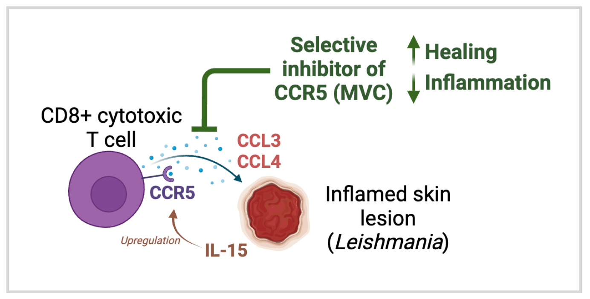

# Code files for CCR5-Leishmaniasis Sacramento et al. 2024

This is the R code associated with the human sequencing datasets in:

<strong>CCR5 promotes the migration of CD8+ T cells to the leishmanial lesions</strong>

<em>Laís Amorim Sacramento, Camila Farias Amorim, Claudia G. Lombana, Daniel Beiting, Fernanda Novais, Lucas P. Carvalho, Edgar M. Carvalho, Phillip Scott</em>

Unpublished, manuscript under review, 2024. Available as a Biorxiv preprint at https://www.biorxiv.org/content/10.1101/2023.10.10.561700v1

<strong>Abstract:</strong>

Cytolytic CD8+ T cells mediate immunopathology in cutaneous leishmaniasis without controlling parasites. Here, we identify factors involved in CD8+ T cell migration to the lesion that could be targeted to ameliorate disease severity. CCR5 was the most highly expressed chemokine receptor in patient lesions, and the high expression of CCL3 and CCL4, CCR5 ligands, was associated with delayed healing of lesions. To test the requirement for CCR5, Leishmania-infected Rag1-/- mice were reconstituted with CCR5-/- CD8+ T cells. We found that these mice developed smaller lesions accompanied by a reduction in CD8+ T cell numbers compared to controls. We confirmed these findings by showing that the inhibition of CCR5 with maraviroc, a selective inhibitor of CCR5, reduced lesion development without affecting the parasite burden. Together, these results reveal that CD8+ T cells migrate to leishmanial lesions in a CCR5-dependent manner and that blocking CCR5 prevents CD8+ T cell-mediated pathology.

 Included in this repo:

1. R script and R objects with analyses on chemokine profiles were peformed the dataset published with the [Amorim et al. 2019 GEO #GSE127831](https://stm.sciencemag.org/content/11/519/eaax4204?rss=1). The purpose was to highlight genes encoding for T cell chemotaxis (ligands and receptors). The R objects were generated from the scripts on the Amorim et al. 2019 R project
